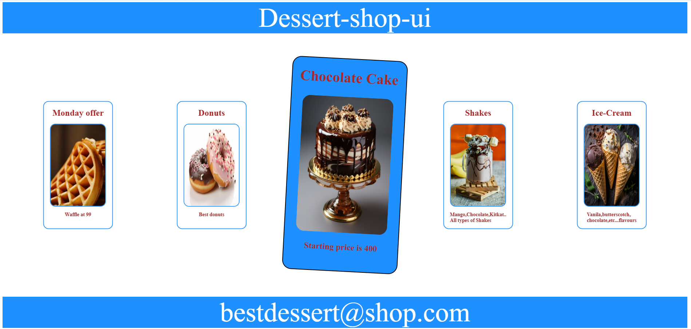

## Dessert-shop-ui
A simple dessert shop UI made using HTML and CSS.

This project is a beginner frontend practice project that showcases different dessert items like cakes, donuts, waffles, shakes, and ice cream in a modern card-style layout.

## ✨ Features

- Beautiful dessert landing page
- Clean UI design
- Product cards with images
- Simple responsive layout
- Attractive color combination
- Beginner-friendly frontend project

## 🛠 Technologies Used

- HTML5
- CSS3

## 🎯 Purpose of Project

This project was created to practice:
- HTML structure
- CSS styling
- Flexbox layout
- Image positioning
- UI designing

## 🚀 Future Improvements

- Make website fully responsive
- Add animations
- Add JavaScript interactions
- Add online ordering feature
- Improve mobile design

## 📸 Project Preview

## 👨‍💻 Author

Made with Nikita Maurya

## ⭐ GitHub

If you like this project, feel free to star the repository.
